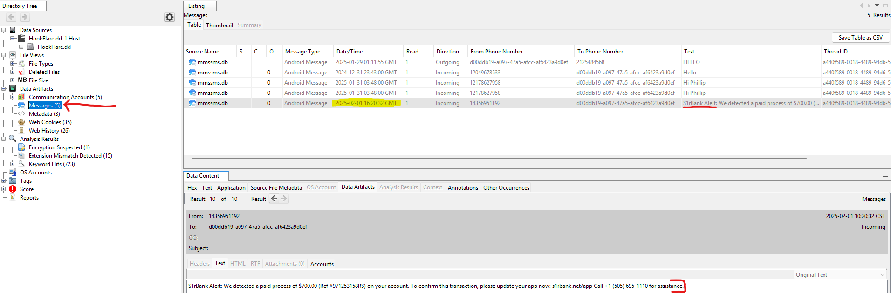
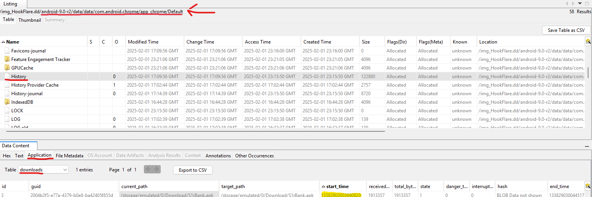
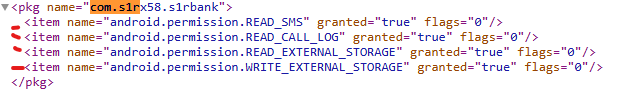
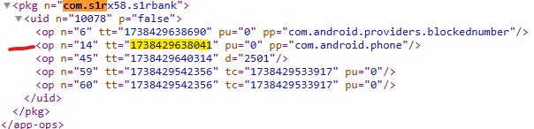
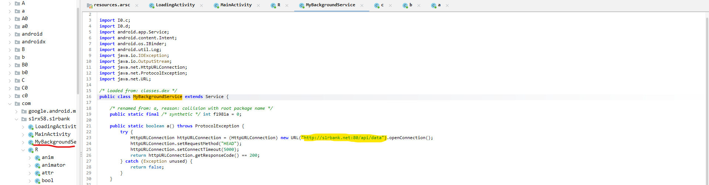
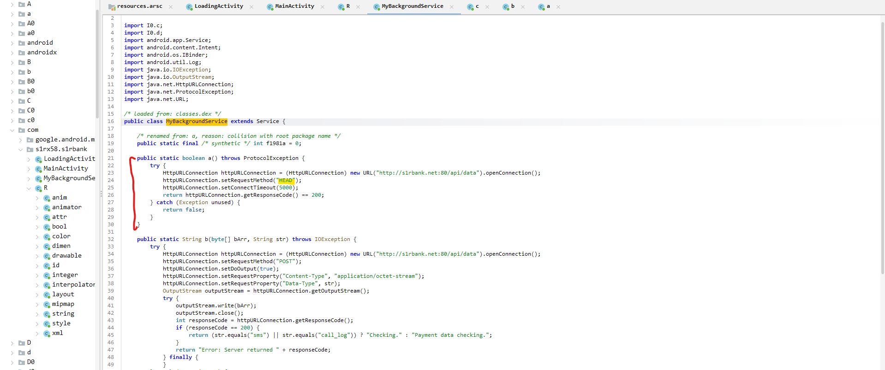

This Defensive CTF focuses on analyzing a smishing attack that lead to a malicious apk being downloaded  

Tools Used:  
&emsp;Autopsy  
&emsp;https://www.epochconverter.com/webkit  
&emsp;apktools  
&emsp;https://www.unixtimestamp.com  
&emsp;jadx-gui  
&emsp;Wireshark  
&emsp;CyberChef  

Foundation:  
&emsp;For simplicity, open the .dd image in Autopsy as a disk image & set the timezone to UTC+0  

1. Provide the UTC timestamp of the phishing SMS.   
&emsp;Under Data Artifacts -> messages, I saw 4 greetings.
&emsp;Then a 5th message from a bank about a transaction, and to confirm it, you need to update the app from a specific URL.  
&emsp;This is a very suspicious message. The time of the message is under the Date/Time column  
&emsp;"2025-02-01 16:20:32"
  

3. Provide the UTC timestamp marking the start of the malicious application download.  
&emsp;The download is a link, not in an app store, so I checked Chrome's download history in Autopsy by going to  
&emsp;android-9.0-r2/data/data/com.android.chrome/app_chrome/Default/History, then I opened the application tab and the downloads table.  
&emsp;I got a start time of 13382903003690820. This is in webkit time, so I used a converter(https://www.epochconverter.com/webkit)  
&emsp;"2025-02-01 17:03:23"
  

4. Provide the package name of the malicious application.  
&emsp;From the Chrome download history, I kept a note of the download destination(android-x/data/media/0/Download/S1rBank.apk)
.png)  
&emsp;I found the download and extracted it from Autopsy.  
.png)  
&emsp;I opened a CMD prompt in the folder where it was extracted to and ran "apktools d .\S1rBank.apk"
.png)  
&emsp;Then go to the extracted folder and open the AndroidManifest.xml, and you will see package =   
&emsp;"com.s1rx58.s1rbank"
.png)  

6. Provide the number of runtime permissions granted to the malicious application.  
&emsp;In Autopsy, go to android-x/data/system/users/0/runtime-permissions.xml, and open it in an external window  
&emsp;Then look for the package name identified in Q3 and count the permissions  
&emsp;"4"
  
  
8. Provide the last access timestamp for the read sms permission used by the malicious application.  
&emsp;In Autopsy, open the android-x/data/system/appops.xml in external view  
&emsp;Ctrl+f the package name in Q3, You will have to know the operation integer to string correlation which varies by android version.  
&emsp;In this version, 14 is equal to READ_SMS, so convert the Unix timestamp to human human-readable format and get   
&emsp;"2025-02-01 17:07:18"
  

10. Provide the URL used by the malware for data exfiltration.  
&emsp;Using jadx-gui, open the .apk and then go to Source Code/com/s1rx58.s1rbank  
&emsp;You get 4 classes; R can be ignored. MyBackgroundService handles the C2 creation  
&emsp;"http://s1rbank.net:80/api/data"
  

12. The malicious application checks if the server is live before sending data. Provide the HTTP method used for this check.  
&emsp;The first function in MyBackgroundService, "a", creates a simple connection to the C2 server and returns true if it is successful  
&emsp;The second line says the method it uses,  
&emsp;"HEAD"
  

14. If the primary server is unavailable, the malicious application redirects data exfiltration to an alternate URL. Identify and provide the alternate URL.  
&emsp;Checking the usage shows that IO.c.doInBackground uses the connection check function "a".
.png)  
&emsp;If the connection check passes, it uses the other function in MyBackgroundService ("b") to send a message.
&emsp;If the connection fails, it goes to B.h.IO, which has a hardcoded Discord webhook as a backup
.png)  
&emsp;"https://discord.com/api/webhooks/1334648260610097303/-Lkxr0eZRO_fb_SaumBbBMZyANM3lyeCkR-E1NXXRASPbtRdNksQSzx4pY1ZGQkFR2H8"
.png)  

16. The malicious application encrypts data before sending it to the server. Provide the encryption key used.  
&emsp;From IO.c.doInBackground the message is the variable bArrEncode which is base64 encoded message.
&emsp;The message is in plaintext above in the variable sb, but it is also encrypted in B.h.C
.png)  
&emsp;And in B.h.C the key is in plaintext  
&emsp;"0x_S1r_x58!@#53cuReK371337!$%^&*"
.png)  

18. Credit card information was stolen. What was the second line in the exfiltrated payment information?  
&emsp;In the pcap we can find a few calls to the c2 server but the data is encrypted and encoded.
&emsp;Using the filter ' http.request.full_uri == "http://s1rbank.net/api/data" ' we can see all the c2 requests.
&emsp;As expected, for every message, there is a connection check with the HEAD method
&emsp;The first post request is about card details, the second post is every message recorded, and the third one was blank.   
.png)  
&emsp;I set up a CyberChef recipe that first uses "From Base64" and then AES decrypt with EDB and the key from Q9 as UTF8. [CyberChef](https://gchq.github.io/CyberChef/#recipe=From_Base64('A-Za-z0-9%2B/%3D',true,false)AES_Decrypt(%7B'option':'UTF8','string':'0x_S1r_x58!@%2353cuReK371337!$%25%5E%26*'%7D,%7B'option':'Hex','string':''%7D,'ECB','Raw','Raw',%7B'option':'Hex','string':''%7D,%7B'option':'Hex','string':''%7D)&input=L05WRVF3ZVpxRTNjOEJEeFR2MHZ3Ynd2OEF4MVJ5MEs2K21VVTdkeVVqaWNPdTdQRW5yUEhJRW1VZS83Y2NmS21MS21TMlF3SVFZTjhibTV4aDY0c0l6eWt5UUhXc05QS0Rud3lRZkNObEtuczZ2UGxPbUpvYzh2MDAzbmJxWkwNCg&ieol=CRLF)  
&emsp;Since the question is about credit card information, we are interested in the first post message, and the second line is   
&emsp;"Card Number: 5453004085527987"
.png)  

